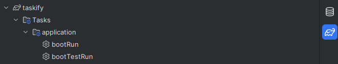
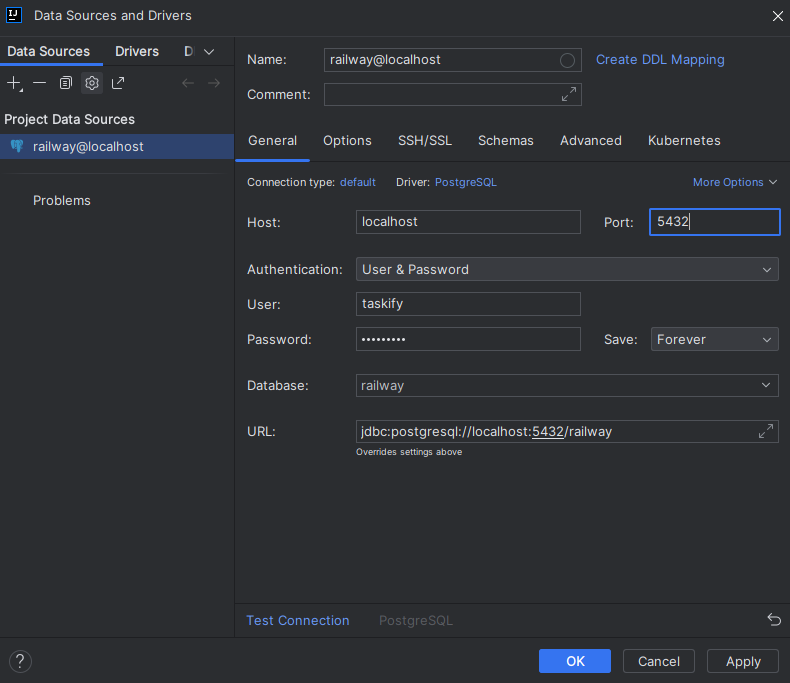
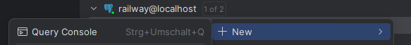

# Taskify

Taskify ist eine kleine Web-App zur Aufgabenverwaltung mit Login, Teams, Aufgabenliste und Kanban-Board.

## Lokal starten

### Voraussetzungen

- Java 21
- Docker / Docker Compose
- Gradle Wrapper ist im Projekt enthalten (`./gradlew`)

### 1. Datenbank starten

Die PostgreSQL-Datenbank wird mit diesen Werten aus `.env` gestartet:

Mann musst zuerst das File `example.env` zu `.env` umwandeln.

```env
POSTGRES_USERNAME=taskify
POSTGRES_PASSWORD=taskifypw
```

Starte den Docker-Desktop und dannach im Projektordner:

```bash
docker compose up -d
```

### 2. Anwendung starten

Danach starten:
`bootRun`



Die App ist danach erreichbar unter:

```text
http://localhost:8080
```

## Benutzer und Rollen

Es gibt zwei Rollen:

| Rolle | Bedeutung                        |
|---|----------------------------------|
| `USER` | Normaler Benutzer / Teammitglied |
| `ADMIN` | Administrator / Team erstellen   |

### Normaler Benutzer

Normale Benutzer können sich selbst über die App registrieren:

```text
http://localhost:8080/register
```

Beispiel:

```text
Benutzername: user
Passwort: Password123!
```

Nach der Registrierung kann man sich über `/login` anmelden.

Ein normaler Benutzer kann:

- eigene Aufgaben erstellen
- Aufgaben sehen, die ihm zugewiesen sind
- Aufgaben sehen, die er erstellt hat
- Aufgaben von Teammitgliedern sehen
- Aufgaben bearbeiten oder löschen, auf die er Zugriff hat
- das Board verwenden
- eigene Profil- und Login-Daten in den Settings ändern

### Admin-Benutzer

Ein Admin kann zusätzlich:

- alle Aufgaben sehen
- Teams erstellen
- alle Teams sehen
- Teamleiter festlegen
- Mitglieder verwalten

Es gibt im Code keine fix vorbereiteten Testbenutzer. Beim ersten Start muss deshalb zuerst ein Benutzer registriert werden.

Falls ein Admin benötigt wird, kann ein registrierter Benutzer direkt in der Datenbank auf `ADMIN` gesetzt werden (in der Produktion würde das Suppor-Team diese Änderungen übernehmen):
1. Öffne die DB-Settings, klicke dazu auf der rechten Seite auf das DB-Symbol.
2. Verbinde dich mit der Datenbank. Benutze die Daten von dem `.env` File. Der Name muss auf `railway` gesetzt werden. (siehe Bild unten)

3. Es sollte sich automatisch eine DB-Konsole öffnen. Wenn nicht mache einen rechts Klick auf `railway` und dann `New` und wähle dann `Query Console` aus.

4. Danach führe dieses Script aus um dein User, Admin-Berechtigungen zu geben. 
```sql
UPDATE user_entity
SET role = 'ADMIN'
WHERE name = 'user';
```

Danach neu einloggen.

## Wichtige Funktionen

### Registrierung und Login

1. `/register` öffnen
2. Name und Passwort eingeben
3. Danach über `/login` anmelden

Passwort-Regel:

- mindestens 9 Zeichen
- mindestens ein Grossbuchstabe
- mindestens ein Sonderzeichen

### Meine Aufgaben

Unter `MyTaskify` sieht man die Aufgabenliste.

Beispiel:

1. Auf `Neue Aufgabe` klicken
2. Titel eingeben, z. B. `Dokumentation schreiben`
3. Status auswählen, z. B. `Zu erledigen`
4. Risiko auswählen, z. B. `Mittel`
5. Verantwortlichen auswählen
6. Speichern

Aufgaben können danach geöffnet, bearbeitet oder gelöscht werden.

### Board

Im Board werden Aufgaben nach Status angezeigt:

- Offen
- Zu erledigen
- In Bearbeitung
- In Review
- Abgeschlossen

Man kann Aufgaben per Drag-and-Drop in eine andere Spalte verschieben. Zusätzlich gibt es Filter nach Text, Risiko und Verantwortlichem.

### Teams

Im Bereich `Team` sieht man die eigenen Teams. Admins sehen alle Teams und können neue Teams erstellen.

Beispiel als Admin:

1. `Team erstellen` klicken
2. Teamname eingeben, z. B. `Development`
3. Teamleiter auswählen
4. Team speichern
5. Danach über `Mitglieder verwalten` Benutzer hinzufügen

### Settings

In den Settings kann der angemeldete Benutzer seine eigenen Daten anpassen:

- Name ändern
- Passwort ändern

Die Rolle wird nur angezeigt und kann dort nicht direkt geändert werden.

## Produktion
Wir haben uns für die Seite [Railway.com](https://www.railway.com)  entschieden um unser Projekt zu veröffentlichen.

Unsere Seite ist unter dieser URL verfügbar:
[Taskify](https://modul183-laurin-jeremy-leon-production.up.railway.app/)